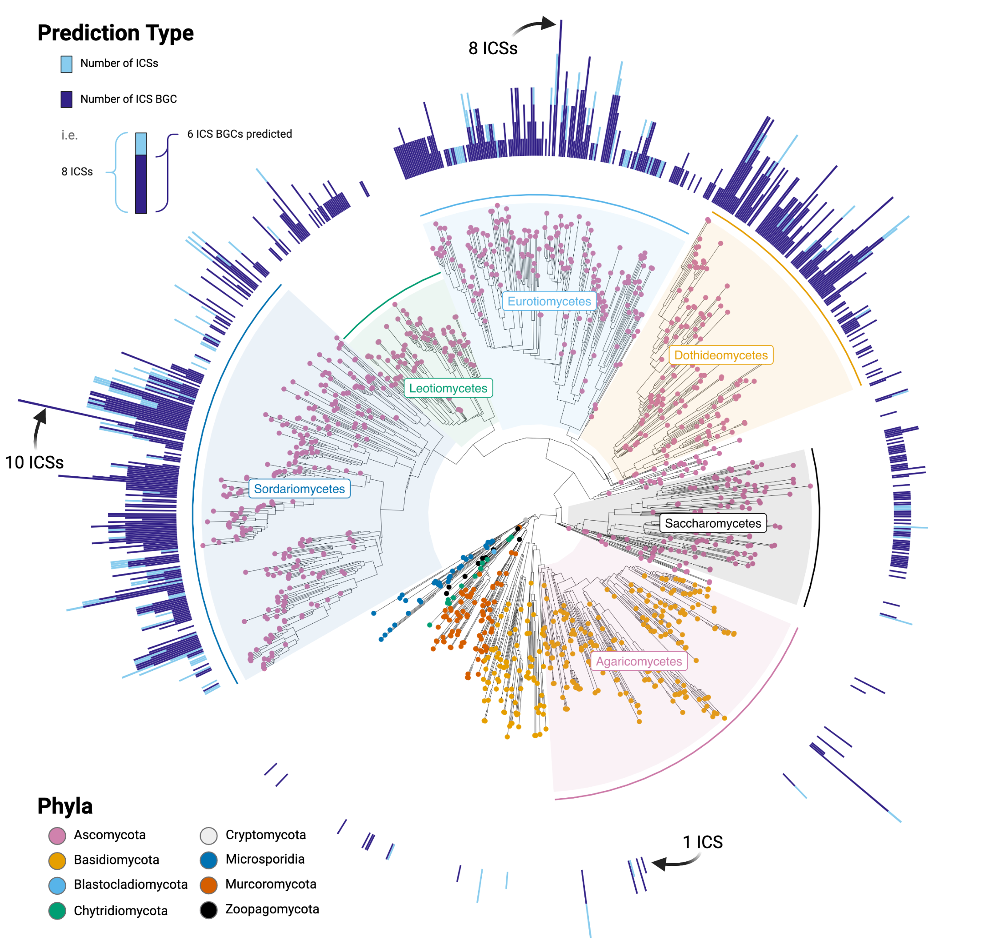

# *Explanation of repository's organization:*
Reproducible code and data repository for the fungal ICS BGC prediction publication. All of the core code used in the publication in addition to the raw prediction files can be found here. 

The metadata for the genomes in addition to tables that include more information on select BGCs can be found in the **Supplemental Information**. 

## **ReproducipleScripts.md**
This markdown file contains all of the major scripts used within this publication. It is sectioned by different key chunks of code, and includes a key on the top of the file. If an outside program or algorithm was used, the parameters used to run said program is listed above the Raw Scripts to make it easier to locate.

## **Folder: ICSBGCs**

This folder stores all of the raw ICS BGC predictions in genbank, gff, and fasta format. The BGC predictions for each genome is organized in a nested folder structure by the the NCBI accession of the genome it was found in.

- The genbank files are compatible with popular natural product programs such as BiG-SCAPE and clinker
- The gff files contain the annotations for the BGC region
- The fasta files contain the entire nucleotide sequence encapsulating each BGC's locus
- NOTE: These are the unedited and unfiltered predictions generated from the ICS-BGC prediction pipeline. Information on specific gene cluster familes, or refined BGC predictions can be found in other folders, and in the supplemental information
 
## **Folder: Conserved Cores**

This folder contains summary tables for the othologs and orthogroups found in each GCF (if analyzed for such patterns). Each GCF will have two folders:
- **ConservedOrthogroups_50** displays the orthologous gene groups found across all of the BGC predictions (as determined with Orthofinder)
  - The species with the gene are shown, along with what domains were detected in said protein. The domain predictions can be particually inaccurate for this table, as different species can have different protein domain predictions for the same orthologous gene
- **OrthologsFULLTable** is the full summary table showing exactly which protein in a given BGC was sorted into a family of orthologous genes. If trying to match this table to the other table, look at the GroupName column. This value will match on each file. 
 
## **Folder: Trees**

This folder contains all of the key trees generated in this publications, each sorted into their own folder. When relavent, log files produced by IQTree that shows information such as the evolutionary model selected by ModelFinder and bash command is provided.
